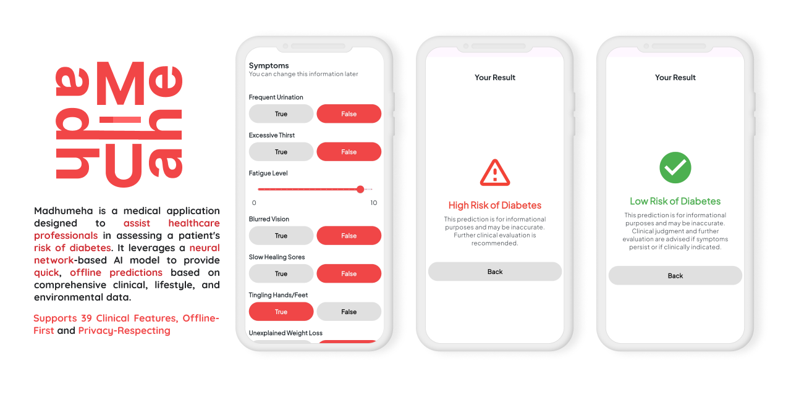

# Madhumeha

## Overview
Madhumeha is a health-focused mobile application designed to predict the risk of diabetes using a machine learning model trained on 39 comprehensive health-related features. The app is especially useful for healthcare workers, clinics, and medical students who need quick and portable inference tools.

## Features
- Flutter-based cross-platform mobile application
- On-device ML inference using TensorFlow Lite
- Input form for 39 health-related features, including:
    - Personal & family history
    - Lifestyle habits
    - Medical symptoms & lab values
- Clean UI with categorized input screens
- RobustScaler preprocessing reproduced in Dart
- Fast binary classification: High Risk vs Low Risk

## Tech Stack
- **Frontend**: Flutter (Dart)
- **Backend ML Model**: Python, TensorFlow, RobustScaler
- **Model Deployment**: TFLite
- **State Management**: setState (simple architecture)

## Model 
- Uploaded TFLite and H5 [Repository](https://github.com/moozunch/Neural-Networks-Diabetes-Binary-Classification.git) or [Kaggle](https://www.kaggle.com/code/annisaputriaprilia/diabetes-binary-classification-tested)  

## Use Case
**Primary Target:**
- Healthcare providers in clinics or community centers
- Medical students & researchers

**Future Expansion:**
- Lite version with reduced features for the general public

## Author
Developed with ❤️ by Annisa Putri Aprilia

## License
This project is licensed under the Apache License 2.0. See the [LICENSE](LICENSE) file for details.
